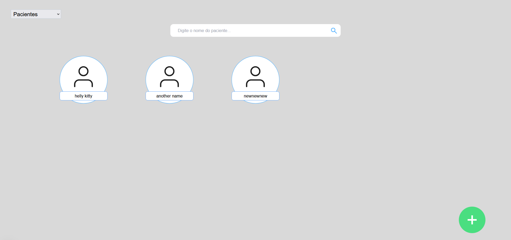
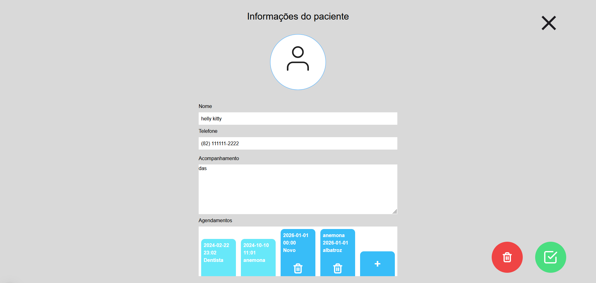
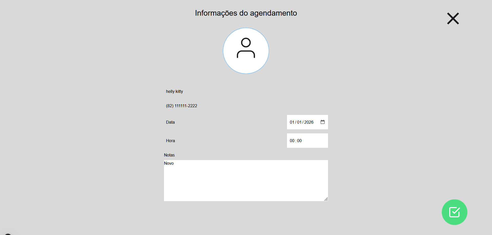
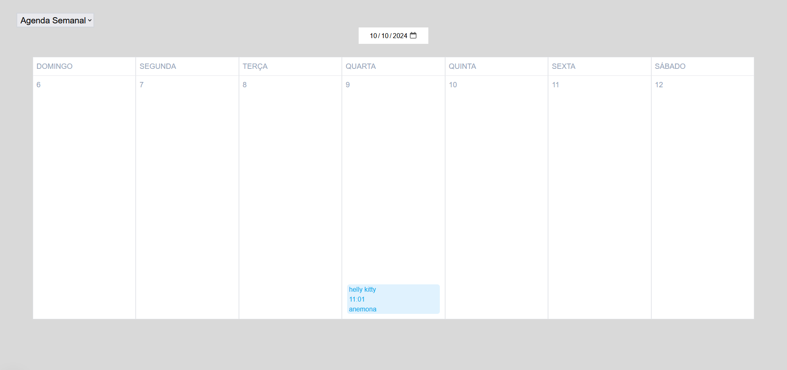

# Site for patient scheduling app

This web application is made for the task of creating an environment of creating and managing patients and it's schedules. Thus, the system contains CRUD for patient and schedules, and also patient search and weekly schedule visualization.

## Pages of the system

- Menu
  
- Patients Menu
  
- Patient Example
  
- Schedule Example
  
- Weekly Schedule
  

## System commands and specification

### Starting system with Makefile

You can enter the cmd `make` (if you have Makefile installed in your system), to start both backend and frontend as developer. Note that both the backend and frontend is launched in separate terminals, and it is made because the developer may want to keep track of the outputs of both the different ends of the application.

### Ports and locations

Note that the frontend is running in the `localhost` on the port `3000`; thus, when starting with the above command (`make`), you will then need to enter `localhost:3000` in your browser to use the frontend system. Also, note that the **frontend** automatically connects to the **backend**.

The **backend** is running on `localhost` on port `3030`; thus, when connecting on both **api clients** or **frontend**, you'll need to connect to location `localhost:3030`.
